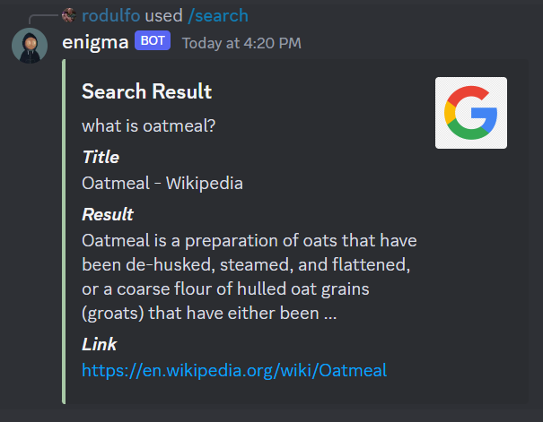
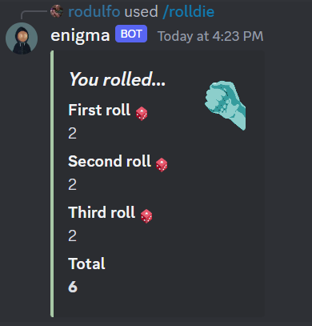

## Features

**Search**
- Google search, retrieves the single most relevant result based on query.

    
Screenshots

    

**Entertainment**
- Greeting of new users, with a random Danny DeVito joke.
- Roll a random number based the number of 6 sided die thrown. Limit is 5 die.

    
Screenshots

    

**Administrative**
- Kick all users at once 
- Send a message as *enigma*
- Clear all messages of a channel

## Manual
| Slash Command | Parameters | Example | Description |
| :--: | :-- | :-- | :-- |
| /search | query - Word or phrase to search (required) | /search query:What is oatmeal? | Fetches the most relevant result on google, based on your query |
| /rolldie | number - Number of dice to roll (max = 5) (optional) (default = 1) | /rolldie number:3 | Rolls an imaginary 6 sided dice, returns a random number based on number of dice | 
| /send | message - Message to send (required) | /send message:Anyone know what is oatmeal? | Send a message as *enigma* to the current channel (Requires elevated permissions) |
| /kick | reason - The reason for kicking (optional) (default = "No reason, just felt like it") | /kick reason:Eats oatmeal | Kicks all of the current server |
| /clear | (none) | /clear | Clears all messages of the current channel |
